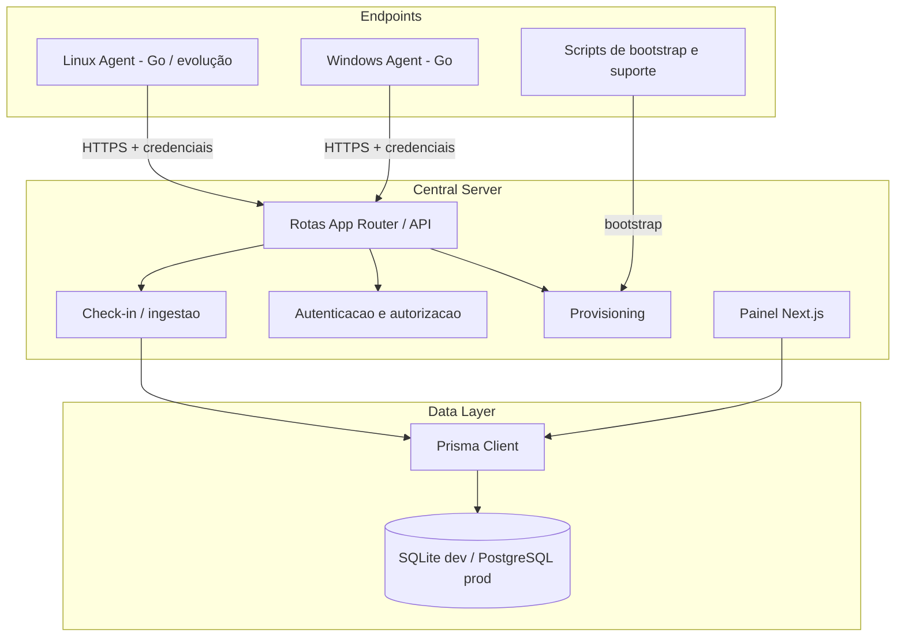

# Arquitetura

Status: canonical
Scope: permanent
Last-reviewed: 2026-04-02

## Visão geral

Inventario Enterprise segue uma arquitetura **agent-based** com postura **Zero Trust**, separando:

- coleta nos endpoints
- ingestão autenticada no backend
- persistência relacional
- visualização e provisioning no painel web

## Topologia atual

## Componentes canônicos

### 1. Aplicação web

- `app/`
- `lib/`
- `components/`

Responsável por:

- painel administrativo
- criação de clientes
- emissão e rotação de chaves
- download/bootstrap do agente
- visualização dos dados de inventário
- shell operacional tenant-scoped em `/tenant/[clientSlug]/*`

### 2. Agente principal

- `agent-go/`

Responsável por:

- coleta local
- registro do agente
- check-in autenticado
- execução operacional no endpoint

### 3. Scripts auxiliares

- `scripts/agent/`

Responsáveis por:

- bootstrap
- compatibilidade
- suporte operacional

Não devem ser tratados como implementação canônica do coletor.

## Fluxo de provisioning

1. Admin cria `Client`
2. Sistema gera `enrollmentKey`
3. Endpoint ou operador usa `client + enrollmentKey`
4. `POST /api/agent/register` emite `apiKey`
5. Agente instalado passa a usar `X-API-Key`
6. Check-ins futuros usam apenas a credencial do agente

## Fluxo de ingestão

1. agente envia payload para `POST /api/agent/checkin`
2. backend valida `X-API-Key`
3. backend resolve `AgentAuth`
4. backend faz upsert de `Device` por **`agentAuthId`**
5. backend atualiza entidades filhas (`Hardware`, `Network`, `Disk`, `Software`)
6. backend registra `CollectionLog`

## Invariantes arquiteturais

- `Device` é vinculado a `AgentAuth`
- a identidade do endpoint no backend é `agentAuthId`
- isolamento por tenant não pode depender apenas de `hostname`
- rotas operacionais do painel devem carregar tenant explícito na URL
- segredos não devem ser persistidos em plaintext no servidor
- o agente só pode enviar dados da própria máquina

## Postura de segurança

### Autenticação

- admin: `X-Admin-Secret`
- provisioning: `client + enrollmentKey`
- agente: `X-API-Key`

### Criptografia

- HTTPS/TLS é requisito para operação séria

### Persistência de segredos

- geração em plaintext apenas uma vez
- armazenamento no backend apenas por hash SHA-256

### Validação

- uso de `zod` nas bordas onde já houver suporte
- evolução pendente para schema forte no `checkin`

## Convenções de implementação

- usar App Router do Next.js
- preferir validação explícita nas entradas
- manter Prisma como camada padrão de acesso a dados
- evitar SQL cru
- manter mudanças pequenas e alinhadas às docs canônicas

## Lacunas atuais conhecidas

1. RBAC do painel ainda incompleto
2. validação do payload de check-in ainda parcial
3. rate limiting ainda não implementado
4. DPAPI do agente ainda pendente
5. distribuição web atual prioriza Windows

## Escopo de rotas do painel

- `/clients`: área administrativa global para provisionamento e entrada no painel
- `/tenant/[clientSlug]/*`: área operacional isolada por tenant
- rotas globais legadas de inventário devem redirecionar para `/clients` em vez de expor dados consolidados
